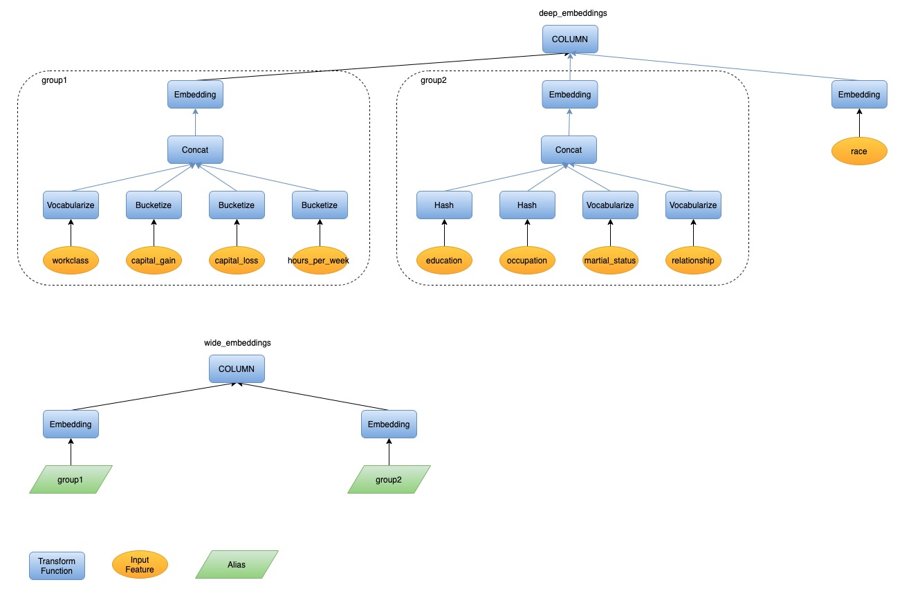
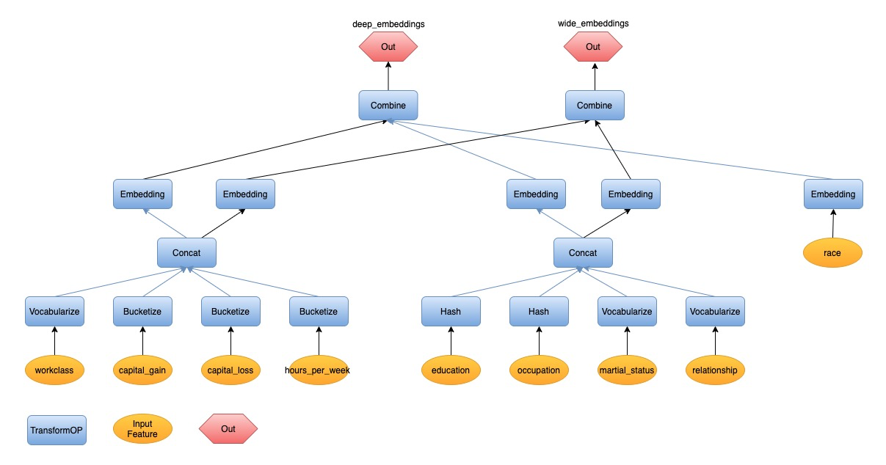
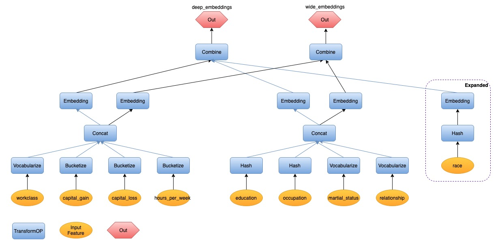

# Data Analysis and Tranformation

## The Problem

We want to add data analysis, in addition to data transformation, into the end-to-end machine learning pipeline generated by SQLFlow.

End-to-end machine learning means a pipeline from raw data to model training and applications. With SQLFlow, we propose to describe complex pipelines with SQL in concisely.  An essential part of the solution is to describe the processing of raw data into model inputs. SQLFlow provides a COLUMN clause for this purpose.

Currently, SQLFlow converts content in the `COLUMN` clause into the Python source code of data transformation.  The following example would call the Feature Column API [`tf/feature_column/categorical_column_with_hash_bucket`](https://www.tensorflow.org/api_docs/python/tf/feature_column/categorical_column_with_hash_bucket) from TensorFlow to convert a string `address` from the database into a single-element tensor of an integer ID.

```sql
SELECT * FROM welfare TO TRAIN DNNRegressor COLUMN hash_bucket(address, 1000) LABEL income;
```

However, data transform often requires parameters. The above example requires the bucket size, 1000. Other examples include

```SQL
standardize(age, mean, stdev)
normalize(size, min, max)
categorize(city, city_name_list)
```

The challenge is -- users don't want to specify these parameters; instead, they want SQLFlow to do the data statistics and derives these parameters from data automatically.  So, the above examples become

```SQL
standardize(age)
normalize(size)
categorize(city)
```

In the terminology of TFX Transform, the word *analysis* refers to data statistics that derives the above parameters, given which, the *transforming* refers to the conversion of raw data into model inputs.  This design document is about making SQLFlow support data analysis, in addition to transformation.

## The Syntax Extension

Without any syntax extension, users can write SQL statements for data analysis.  For example, the following SQL statement works with MySQL and can normalize the field `size` of table `plates`.

```sql
SELECT 1.00 * (t1.size - t2.size_min) / t2.size_range
FROM plates t1
JOIN
(
    SELECT
        MIN(size) AS size_min,
        MAX(size) - MIN(size) AS size_range
    FROM plates
) t2
ON 1 = 1
```

Unfortunately, the above code is tricky and hard to read.  And users might have to write it multiples time -- one before training and one before the prediction -- thus doubles the source code complexity.

For the goal of making deep learning more straightforward, we hope our users can write the following statement.

```sql
SELECT * FROM plates TO TRAIN DNNRegressor COLUMN normalize(size) LABEL price INTO a_model;
```

This syntax implies that SQLFlow can convert the above statement into a Python program that does data analysis and data transformation.

To use the trained model to make predictions, we hope the users don't have to rewrite the COLUMN clause.   For example, the following statement assumes that the table `new_plates` has a field `size`. The converted Python code should normalize `size` before sending it to the input of `a_mode`.

```sql
SELECT * FROM new_plates TO PREDICT price USING a_model;
```

If the user doesn't want normalization, but the raw value, as the input, she could write the following.

```sql
SELECT * FROM new_plates TO PREDICT price USING a_model COLUMN size
```

Or, if she wants standardization instead of normalization, she could write the following.

```sql
SELECT * FROM new_plates TO PREDICT price USING a_model COLUMN standardize(size)
```

How if the table new_plates doesn't have the field used to train the model? How if there is no field named `size`, but a field `diameter`. We should allow users to use the latter as well.

```sql
SELECT * FROM new_plates TO PREDICT price USING a_model COLUM normalize(diameter)
```

Please be aware that if the user wants normalization, she must write `normalize(diameter)` instead of `diameter`.  The following example uses the raw value of `diameter` without normalization.

```sql
SELECT * FROM new_plates TO PREDICT price USING a_model COLUMN diameter
```

## The Challenge

From the above examples, we see that a challenge is that the `TO TRAIN` clause must be able to save the input field names and the data analysis results and transformation steps together with the model, so to make sure that the predictions using the same data transformation as the training.

## Related Work

### TensorFlow Transform

[TensorFlow Transform](https://www.tensorflow.org/tfx/transform/get_started) is the open source solution for data transform in [TensorFlow Extended](https://www.tensorflow.org/tfx/guide). Users need write a Python function `preprocess_fn` to define the preprocess logic. The preprocessing function contains two groups of API calls: TensorFlow Transform Analyzers and TensorFlow Ops. Analyzer will do the statistical work on the training dataset once and convert to constant tensors. And then the statistical value and TensorFlow Ops will make the concrete transform logic as a TensorFlow graph and then convert the data record one by one. The graph will be used for both training and serving.  
Let's take [normalizing (min-max normalization)](https://en.wikipedia.org/wiki/Feature_scaling) the column value `capital_gain` in [census income dataset](https://archive.ics.uci.edu/ml/datasets/Census+Income) for example. The following is the `preprocess_fn` definition with TensorFlow Transform:

```python
import tensorflow_transform as tft

def preprocess_fn(inputs):
    outputs = inputs.copy()
    outputs["capital_gain"] = tft.scale_to_0_1(inputs["capital_gain"])
    return outputs
```

From users' perspective, SQLFlow users prefer to write SQL instead of python. It's not user-friendly if we integrate TF Transform with SQLFlow directly.  

### Internal System

The feature engineering library in the internal system is configuration driven. It contains some primitive transform ops and users compose the transform logic with a configuration file. A part of the parameters in the configuration are the statistical values. Users need to do analysis work on the dataset manually using SQL at first and then complete the configuration. What's more, the development work of auto analysis is also on-going.  

## Our Approach

Data transform contains two key parts: analyzer and transformer. Analyzer scans the entire data set and calculates the statistical values such as mean, max, min, etc. Transformer refers the statistical values if any as parameters to build the concrete transform logic. And then it transforms the data records one by one. The transform logic should be consistent between training and inference.  


From the perspective of SQLFLow, SQL can naturally support statistical work just like the analyzer. [Feature column API](https://tensorflow.google.cn/api_docs/python/tf/feature_column) and [keras preprocessing layer](https://github.com/tensorflow/community/pull/188) can take charge of the transform work as transformer. We plan to use SQL and feature column/keras preprocessing layer together to do the data analysis and transform work.  

Since we use SQL to do the analysis work, SQL requires the table schema to be wide - one feature per column. So, we will normalize the table schema at first.  

### Normalize Table Schema to Be Wide

Wide table means that it only stores one feature or label in one column. It's more friendly to SQL for data analysis.  

#### Why

Let's take this analysis work for example: calculate the max of `age` and mean of `education_num`.  
If it's a wide table as follows:  

|  age | education_num |  income_category  |
|:----:|:-------------:|:-----------------:|
|  39  |      10       |         0         |
|  52  |      9        |         1         |
|  28  |      13       |         0         |

The SQL statement for analysis is straightforward:

```SQL
SELECT
    MAX(age) AS age_max,
    AVG(education_num) AS education_num_mean
FROM census_income
```

Sometimes users may encode multiple feature values as a key-value string and store it in one column of the table, just like the following table:  

|            features       |  income_category  |
|:-------------------------:|:-----------------:|
|  age:39;education_num:10  |        0          |
|  age:52;education_num:9   |        1          |
|  age:28;education_num:13  |        0          |

We can't use SQL directly to do the same analysis work as above.

#### Proposal

We can provide common tools to normalize the table schema. If the data is stored in MaxCompute table, we can use [PyODPS](https://pyodps.readthedocs.io/en/latest/) + [UDF](https://www.alibabacloud.com/help/doc-detail/73359.htm) to complete the task. Please look at the doc [flatten_odps_key_value_table](./flatten_odps_key_value_table.md) for the detailed design.  

After normalizing the table schema, we can do data analysis and transformation on this normalized table. The preprocess pipeline is described using SQLFlow statement. The logic can be very flexible and [the current synatx of COLUMN clause](https://sql-machine-learning.github.io/sqlflow/doc/language_guide/#column-clause) cannot cover all the scenarios, such as standardize `age`. We want to design SQLFlow syntax extension to fully express the analysis and transform process elegantly.  

### SQLFlow Syntax Extension

We can extend the SQLFlow syntax and enrich the `COLUMN` expression. We propose to add some built-in functions to describe the transform process. We will implement common used functions at the first stage.  

| Name             |    Transformation                                     | Statitical Parameter | Input Type | Output Type |
|:----------------:|:-----------------------------------------------------:|:--------------------:|:-------------------:|:---------------------:|
| NORMALIZE(x)     | Scale the inputs to the range [0, 1]. `out = x - x_min / (x_max - x_min)` |     x_min, x_max     | number (int, float) | float64 |
| STANDARDIZE(x)   | Scale the inputs to z-score subtracts out the mean and divides by standard deviation. `out = x - x_mean / x_stddev` |    x_mean, x_stddev  | number | float64 |
| BUCKETIZE(x, num_buckets, boundaries) | Transform the numeric features into categorical ids using a set of thresholds. |   boundaries  | number | int64 |
| HASH_BUCKET(x, hash_bucket_size) | Map the inputs into a finite number of buckets by hashing. `out_id = Hash(input_feature) % bucket_size` |   hash_bucket_size   | string, int32, int64 | int64 |
| VOCABULARIZE(x)  | Map the inputs to integer ids by looking up the vocabulary | vocabulary_list | string, int32, int64 | int64 |
| EMBEDDING(x, dimension) | Map the inputs to embedding vectors             |          N/A         | int32, int64 | float32 |
| CROSS(x1, x2, ..., xn, hash_bucket_size)  | Hash(cartesian product of features) % hash_bucket_size |          N/A         | string, number   | int64 |
| CONCAT(x1, x2, ..., xn)   | Concatenate multiple tensors representing categorical ids into one tensor. | N/A | int32, int64 | int64 |

*Please check more [discussion](https://github.com/sql-machine-learning/elasticdl/issues/1723) about `CONCAT` transform function*

Let's take the following SQLFlow statement for example.  

```SQL
SELECT *
FROM census_income
TO TRAIN DNNClassifier
WITH model.hidden_units = [10, 20]
COLUMN NORMALIZE(capital_gain), STANDARDIZE(age), EMBEDDING(hours_per_week, dimension=32)
LABEL label
```

It trains a DNN model to classify someone's income level using the [census income dataset](https://archive.ics.uci.edu/ml/datasets/Census+Income). The transform expression is `COLUMN NORMALIZE(capital_gain), STANDARDIZE(age), EMBEDDING(hours_per_week, dimension=32)`. It will normalize the column *capital_gain*, standardize the column *age*, and then map *hours_per_week* to an embedding vector.  

Next, Let's see a more complicated scenario. The following SQL statment trains a [wide and deep model](https://ai.googleblog.com/2016/06/wide-deep-learning-better-together-with.html) using the same dataset.

```SQL
SELECT *
FROM census_income
TO TRAIN WideAndDeepClassifier
COLUMN
    EMBEDDING(
        CONCAT(
            VOCABULARIZE(workclass),
            BUCKETIZE(capital_gain, num_buckets=5),
            BUCKETIZE(capital_loss, num_buckets=5),
            BUCKETIZE(hours_per_week, num_buckets=6)
            ) AS group_1,
        8),
    EMBEDDING(
        CONCAT(
            HASH(education),
            HASH(occupation),
            VOCABULARIZE(martial_status),
            VOCABULARIZE(relationship)
            ) AS group_2,
        8),
    EMBEDDING(race, 8)
    FOR deep_embeddings
COLUMN
    EMBEDDING(group1, 1),
    EMBEDDING(group2, 1)
    FOR wide_embeddings
LABEL label
```

SQLFlow will compile the `COLUMN` expression to Python code of data transformation. Let's take the SQLFlow statement above for example to describe the compilation workflow step by step in the next section.  

### COLUMN Expression Compilation Workflow

#### Parse COLUMN Expression into AST

Given a COLUMN expression, syntax parsing is naturally the first step. We will parse one COLUMN expression to one AST. For the SQL statement containing two column expressions above, we will parse them into two ASTs. Please check the following figure of the AST for the example SQL.  


#### Convert the AST into a DAG of Transform Flow

To convert ASTs into transform flow, we will do a one-on-one mapping at first.

1. Transform Function(AST) to TransformOP(Transform Flow)
2. Input Feature(AST) to Input Feature(Transform Flow)
3. Column Node(AST) to Combine + Out(Transform Flow)
We may have two or more column expressions, one column for one AST (tree structure). If we combine these ASTs, we will get a forest at this time.

We may also have alias with keyword `AS` just like `AS group1` in the example SQL. The alias stands for a part of transform flow which is shared by multiple upstream nodes. And then the forest will become a DAG.


#### Expand the TransformOP

Let's focus on the clause `EMBEDDING(race, 8)` in the example SQL.  
As we know, the SQLFlow statement is intention driven. We tell it to do embedding for the input feature `race` directly and don't tell how to map it into an integer id at first. And the latter is required for the model built using native TensorFlow. So we will expand the `Embedding` TransformOP and add `Hash` to do the id conversion work. The DAG will be expaneded from `race -> Embedding` to `race -> Hash -> Embedding`, just like the following graph.


At this time, we have gotten a complete graph of the transform flow. But some TransformOP don't have all the required parameters, such as `vocabulary list` for `VOCABULARIZE(workclass)`. We will do the data analysis work to derive the parameter value.  

#### Derive the Parameters of TransformOP from Data Analysis

SQLFlow will generate the analysis SQL to calculate the statistical value. Please check the following analysis SQL for each transform function.

NORMALIZE(x)

```SQL
SELECT
    MIN(x) AS x_min,
    MAX(x) AS x_max
FROM data_table;
```

STANDARDIZE(x)

```SQL
SELECT
    AVG(x) AS x_mean,
    STDDEV(x) AS x_stddev
FROM data_table;
```

BUCKETIZE(x, num_buckets=5)

```SQL
SELECT
    percentile(x, 0.2) AS x_bkt_boundry_1,
    percentile(x, 0.4) AS x_bkt_boundry_2,
    percentile(x, 0.6) AS x_bkt_boundry_3,
    percentile(x, 0.8) AS x_bkt_boundry_4
FROM data_table;
```

VOCABULARIZE(x)

```SQL
SELECT DISTINCT(x)
FROM data_table;
```

HASH(x)

```SQL
SELECT (COUNT(DISTINCT(x)) * 3) AS x_hash_bucket_size
FROM data_table;
```

*Note: If we assign COUNT(DISTINCT(x)) as hash_bucket_size, the conflict ratio is high - about 40%. So we multiply it with a factor `3` here. And the factor is tunable here.*

#### Derive the parameters of TransformOP from DAG Walkthrough

Some parameters of TransformOP can't be gotten from data analysis. For example, `Embedding` needs the parameter `input_dimension`, it's equals to `num_buckets` attribute of `CONCAT` which is the dependency of `Embedding`.  
In one sentence, we need walk through the DAG and calculate the parameters of one TransformOP from its dependency.

#### Generate the Transform Python code from the DAG

Now we have a complete DAG: a complete Graph describing the dependency of TransformOPs and each TranformOP has all the required parameters.  
We can make typological sort on the DAG and get an ordered list. Then we generate the python code according to this order. A TransformOP node will generate a line of python code. A line of python code is an api call to [feature column](https://www.tensorflow.org/versions/r2.2/api_docs/python/tf/feature_column) or [keras preprocessing layer](https://github.com/tensorflow/community/pull/188) from TensorFlow native API and our extensions in [elasticdl_preprocessing](https://github.com/sql-machine-learning/elasticdl/tree/develop/elasticdl_preprocessing). Please check the sample code generated from the example SQL: [keras preprocessing layer version](https://github.com/sql-machine-learning/elasticdl/blob/84bf8026565df81521ffdfe55d854428fb1156d4/model_zoo/census_model_sqlflow/wide_and_deep/wide_deep_functional_tensor_interface_keras.py#L129-L228) and [feature column version](https://github.com/sql-machine-learning/elasticdl/blob/84bf8026565df81521ffdfe55d854428fb1156d4/model_zoo/census_model_sqlflow/wide_and_deep/wide_deep_functional_tensor_interface_fc.py#L130-L243).

At this moment, we have gotten the full transform code and can prepare for model training. For the sample SQL, we will combine the transform code and `WideAndDeepClassifier` from model zoo to the submitter program. The bridge between these two parts is important for the combination.  

#### The Bridge Between Transform Code and Model Definition from Model Zoo

The model definition in the model zoo is a python function or a python class. It has some input parameters. The transform python code is built upon feature column api or keras preprocessing layers. The bridge between transform code and model definition should cover the transform logic using both feature column and keras preprocessing layers.  

For functional model，Tensors is a good choice for the bridge. The transform logic for one `COLUMN` expression outputs one tensor, and two expressions output two tensors. So the COLUMN expressions in example SQL output two tensors: `deep_embeddings` and `wide_embeddings`. The python function of the functional model is [`def wide_and_deep_classifier(input_layers, wide_embeddings, deep_embeddings)`](https://github.com/sql-machine-learning/elasticdl/blob/84bf8026565df81521ffdfe55d854428fb1156d4/model_zoo/census_model_sqlflow/wide_and_deep/wide_deep_functional_tensor_interface_keras.py#L47-L66). The names of the output tensors match the names of the input parameters in the function. We will combine the transform code and model definition through parameter binding according to the name.  

For subclass model, please check the [discussion](https://github.com/sql-machine-learning/elasticdl/issues/1867).

## Further Consideration

In the design above, we generated the concrete feature column definition for data transformation in the Transform stage. The actual transform logic on the raw data executes along with the model training process. Based on this design, we can further consider transforming the raw data and writing the transformed result into a new table in the stage.  
After analyzing the data, we construct the TF graph for transform instead of feature column definition and export it to SavedModel. And then we submit a data processing job to transform the raw data by executing UDF with the SavedModel. The whole process is also matched with the TFX pipeline.  
This solution can bring the following benifits:

1. We can reuse the transformed data in the temporary table to execute multipe model training run for different hyperparameter combinations and all the epochs. Data transformation is only executed once.
2. We can support more flexible transform logic such as inter column calculation. Feature column has some limit on the inter column calculation. Please check the [Wiki](https://github.com/sql-machine-learning/elasticdl/wiki/ElasticDL-TF-Transform-Explore#inter-columns-calculation) for more details.

We need figure out the following points for this further solution:

1. Model Export: Upgrade keras API to support exporting the transform logic and the model definition together to SavedModel for inference. [Issue](https://github.com/tensorflow/tensorflow/issues/34618)
2. Transform Execution: We will transform the data records one by one using the transform logic in the SavedModel format and then write to a new table. We also need write a Jar, it packages the TensorFlow library, loads the SavedModel into memory and processes the input data. And then we register it as UDF in Hive or MaxCompute and use it to transform the data.  
